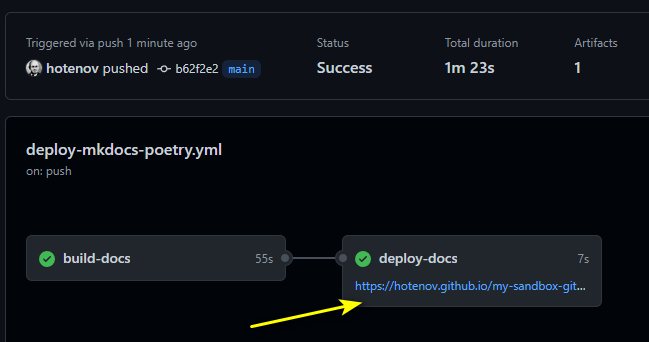

# How to add documentation to your project

This short tutorial describes how to add documentation
to your Python project on GitHub,
using MkDocs, poetry and GitHub actions and GitHub pages.

## Add docs dependencies to your project with poetry

Add McDocs

```plain
poetry add mkdocs@latest --group docs
```

Add Material theme for MkDocs package

```plain
poetry add mkdocs-material@latest --group docs
```

Add mkdocstrings (to generate content from docstrings)

```plain
poetry add mkdocstrings[python]@latest --group docs
```

## Configure your MkDocs configuration file

Create `mkdocs.yml` file in root location of your code repository.

Add `docs/index.md` file, at least _(if you have not added before)_.

Example of simple `mkdocs.yml` file _(with several other files in docs)_.

```yaml
site_name: Selene
site_url: https://hotenov.github.io/selene-with-docs/

nav:
  - Home: index.md
  - "Guides":
    - "Docs Setup": "guides/docs-setup.md"
  - About: about.md

theme:
  name: material
  favicon: img/favicon.ico

plugins:
- search
- autorefs
- mkdocstrings
```

## Change GitHub repository settings

At the moment, GitHub pages added new feature "a custom GitHub Actions workflow". That's why, to [configure your site to publish with GitHub Actions](https://docs.github.com/en/pages/getting-started-with-github-pages/configuring-a-publishing-source-for-your-github-pages-site#publishing-with-a-custom-github-actions-workflow):

1. On GitHub, navigate to your site's repository.

2. Under your repository name, click  Settings.
Repository settings button

3. In the "Code and automation" section of the sidebar, click Pages.

4. Under "Build and deployment", under "Source", select GitHub Actions.


## Create your GitHub actions workflow

Create file (or copy) in your code repository  
`.github/workflows/deploy-mkdocs-poetry.yml`

Use any file name as you want.

Example of workflow file with `poetry`:

```yaml
name: Deploy Docs to Pages

env:
  # Specify Python version to quick change in the future
  # See: https://github.com/actions/setup-python/tree/main#available-versions-of-python
  PYTHON_VERSION: "3.7"


# Controls when the workflow will run
on:
  # Triggers the workflow on push events but only for the "main" branch
  # and docs related files (paths)
  push:
    branches: [ "main" ]
    paths:
      - ".github/workflows/deploy-mkdocs-poetry.ya?ml"
      - "mkdocs.ya?ml"
      - "poetry.lock"
      - "pyproject.toml"
      - "docs/**"

  # Allows you to run this workflow manually from the Actions tab
  workflow_dispatch:

# A workflow run is made up of one or more jobs that can run sequentially or in parallel
jobs:
  # This workflow contains two jobs called "build-docs" and "deploy-docs"

  # Build docs via MkDocs with poetry shell (environment)
  build-docs:
    # The type of runner that the job will run on
    runs-on: ubuntu-latest

    # Steps represent a sequence of tasks that will be executed as part of the job
    steps:
      # Checks-out your repository under $GITHUB_WORKSPACE, so your job can access it
      - name: Checkout repository
        uses: actions/checkout@v3

      - name: Install Python
        uses: actions/setup-python@v4
        with:
          python-version: ${{ env.PYTHON_VERSION }}

      - name: Install Poetry
        run: pip install poetry

      - name: Install Dependencies
        run: poetry install --no-root

      # Build MkDocs static files (in 'site' folder)
      - name: Build docs
        run: poetry run mkdocs build

      # upload the static files as an artifact
      - name: Upload static artifact (.zip)
        uses: actions/upload-pages-artifact@v1
        with:
          path: "site/"

  # Deploy docs job
  deploy-docs:
    # Add a dependency to the build job
    needs: build-docs

    # Grant GITHUB_TOKEN the permissions required to make a Pages deployment
    permissions:
      pages: write      # to deploy to Pages
      id-token: write   # to verify the deployment originates from an appropriate source

    # Deploy to the github-pages environment
    environment:
      name: github-pages
      url: ${{ steps.deployment.outputs.page_url }}

    # Specify runner + deployment step
    runs-on: ubuntu-latest
    steps:
      - name: Deploy docs to GitHub Pages
        id: deployment
        uses: actions/deploy-pages@v1
```

Push it into `main` branch (and other changes above) and Bob's your uncle!

After action will be completed check your GitHub URL to see result.


